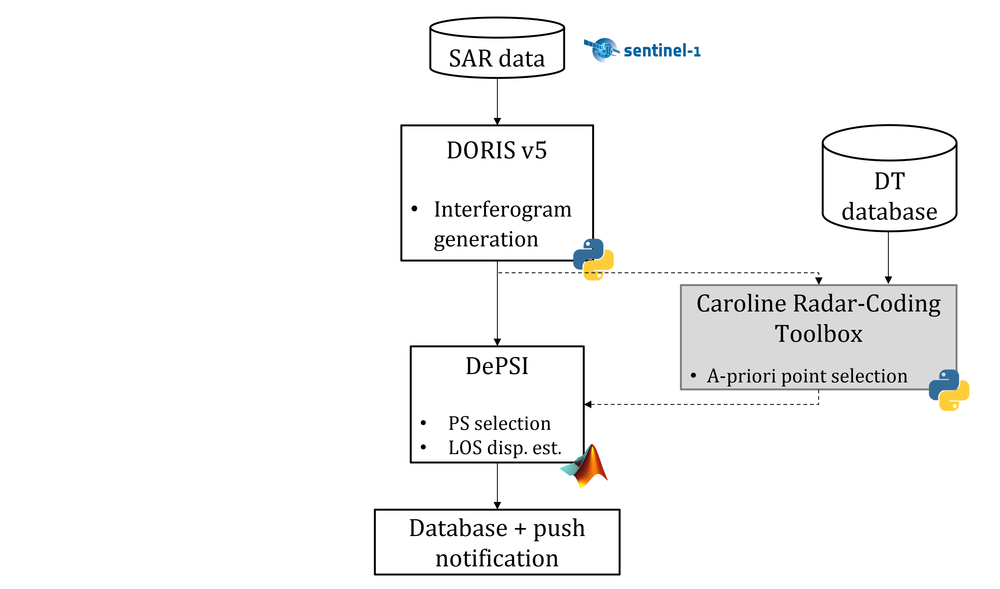
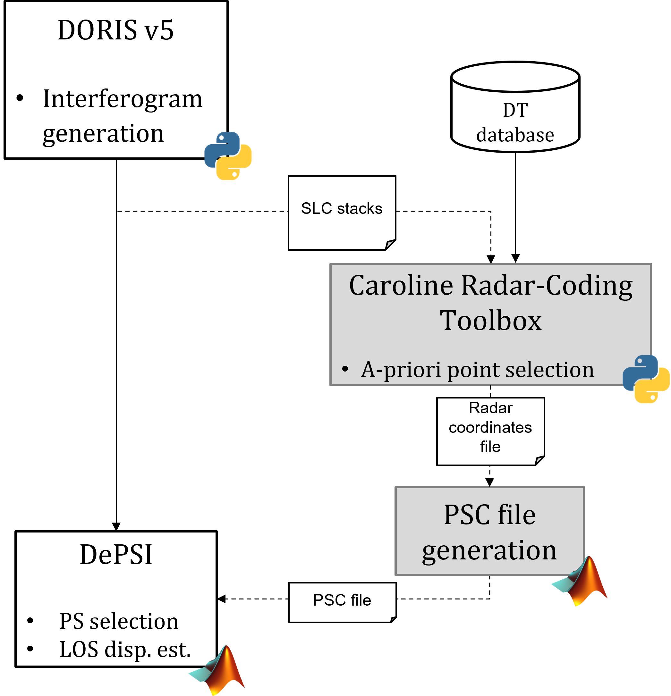
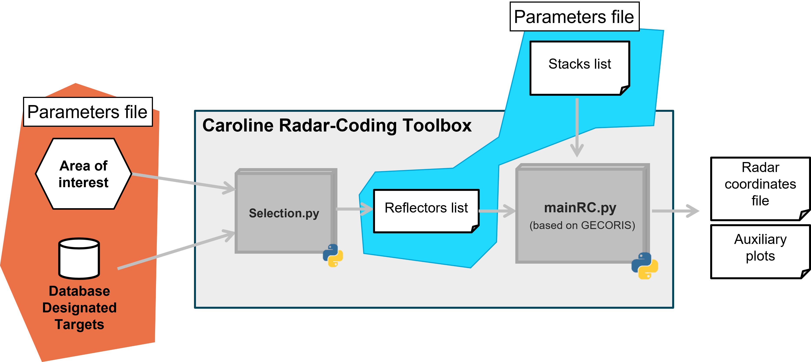
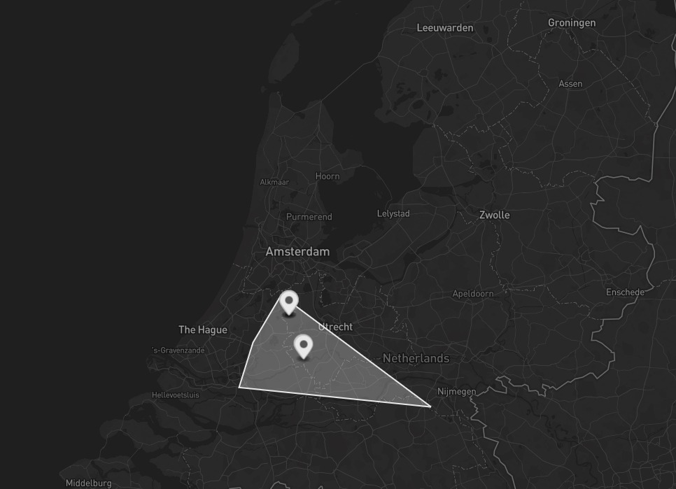
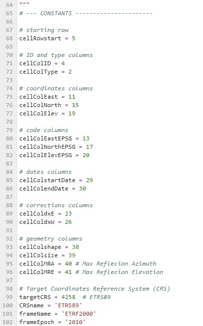

The Toolbox was developed by Paolo Bazzocchi. Official repository can be found at: https://github.com/Pbaz98/Caroline-Radar-Coding-Toolbox

# Caroline Radar-Coding Toolbox (CRCT)
v1.0 - 27/03/2024

## Description

The Caroline Radar-Coding Toolbox (CRCT) is a toolbox aimed at being integrated in Caroline, a computer system to process and analyze InSAR data recursively and automatically.


<figure>
  
</figure>


The CRCT Radar-codes (computes radar coordinates starting from) the position of artificial targets falling within the Area-of-Interest of the stacks processed by Doris, taking the information about them from a database. The latter is denominated Database of Designaed Targets (DT).

The Radar coordinates are computed and stored into a file (Radar coordinates file, in the picture below). From that file, the coordinates can be parsed by an interface code (PSC file generation) into the DePSI working files.

<figure>
  
</figure>


The CRCT itself is therefore interfaced with Doris, DePSI, and the DT Database. In the following picture, a detailed diagram of the I/O interfaces of the code is shown.

<figure>
  
</figure>


The toolbox is composed of two tools: 
+ `selection.py`: aimed at selecting the DT falling into the area of interest
+ `mainRC.py`: aimed at radar-coding the selected DT's coordinates. The latter is based on GECORIS.

### selection.py 

+ *Input* : a `selection.parms` file containing the run parameters

+ *Output* : 3 files containing informations about the selected targets inside an Area of Interest (AoI)
    + `reflectors.json` file, to ensure compatibility with GECORIS
    + `reflectors.csv` file, to ensure compatibility with GECORIS and readability of output
    + `SelectedTargetsMap.geojson` file, to visualize graphically the selected reflectors


### mainRC.py 

+ *Input* : a `RC.parms` file containing the run parameters

+ *Output* : 3 files containing informations about the selected targets inside an Area of Interest (AoI)
    + For each station with ID *xxxx* (es: BARN):
      - `xxxx.json`: json file containing the log of the station's object
      - `xxxx`: directory containing the SAR images cropped around the reflector at each epoch (only the ones when reflector was active)
    + For each stack with ID *s1_yscyyy* (es: s1_dsc037):
      - `s1_yscyyy.json`: json file containing the log of the stack's object
    + `RadarCoordinates`: directory containing the information about the outcome of the RadarCoding process. Below, they are ordered with increasing level of detail:
      1) `s1_yscyyy_RC.csv`: [for each stack] CSV file containing the coordinates of the reflectors. Its format is described in the next section.
      2) `RCSanalysis_s1_yscyyy.png`: [for each stack] graph with the comparison between the predicted intensity and the measured intensity of the selected pixel.
      3) `xxxx_s1_yscyyy_RC.png` [for each station and stack] timeseries of the Radar Coordinates (R,Az) along the stack. This is helpful to evaluate co-registration-induced errors.
  
With reference to the diagram of the CRCT, the Radar Coordinates corresponds to `s1_yscyyy_RC.csv`, while all the others are auxiliary plots.


## Installation

From the terminal:


1. Make sure to have the required libraries installed python environent by running the following line in the environment you'd like to use:
```
pip install openpyxl matplotlib geopandas shapely

```

2. Download  `main.py` and `.parms` file from: https://github.com/Pbaz98/radarcoding-tool.git to the destination directory:

```
git clone https://github.com/Pbaz98/radarcoding-tool.git destination-directory-name
```


**Setting parameters**

An example of the `selection.parms` file is:
```
{
"project" : 'selectionTEST',
"aoiDir" : '/home/caroline-pbazzocchi/algorithm/testAoI/',
"targetDB" : '/home/caroline-pbazzocchi/algorithm/IGRSdata/Database_DesignatedTargets_TUDelft_v20230810.xlsx',
"outDir" : '/home/caroline-pbazzocchi/algorithm/SelectedTargets/',
"convFlag" : 1,                 # 0 = do not ... / 1 = save transformed coordinates in the target CRS in a csv file
"mapFlag" : 1,                  # 0 = do not ... / 1 = save geojson file in outDIr, copypaste to https://geojson.io to display it
"exclTarget" : []             # row indexes of the target to exclude (1 = first target in the Database)
}
```

+ "project": name of the project
+ "aoiDir": path/to/directory containing the shapefile(s) with the area of interest. You can draw an AoI and create the shapefile from geojson.io An example is available in the subfolder examples
+ "targetDB": path/to/database of the designated targets. 
  The up to date version of the TU Delft's Database of designated targets can be downloaded from: https://docs.google.com/spreadsheets/d/1_7z-NkgSXSUaAKjsdMYRlsOjZeyLqc-v/edit?usp=sharing&ouid=104604842686121190070&rtpof=true&sd=true

+ "outDir": path/to/outputDirectory, where the output files will be stored

+ "convFlag": if set to 1, a `.csv` file is generated, containing the coordinates of all the reflectors in the target CRS (by default ETRS89, equal to EPSG:4258). This is useful as the coordinates conversion takes some minutes, so in case we want to perform multiple runs with the same database, after the first run we can copy-paste the converted coordinates (and epsg code) into the corresponding column of our local copy of the database, saving tiume and resources in the following runs.

+ "exclTarget": this list is to be filled with the target's number that we want not to select.
  The target's number is defined as the number in the first column of the Database. For example target 1 is the target with ID_by_operator1= CBW (see database)

NOTE: please specify always absolute paths


**Run the code and read output**

1. Go to the directory where the repository has been cloned:
```
cd path/to/destination-directory-name
```
   and run the script by:
   
```
python main.py selection.parms
```

2. To visualize graphically the result, open the `.geojson` file, and copy-past the content to the right box at https://geojson.io. a map with AoI and the selected targets will be displayed:

<figure>
  
</figure>


**Troubleshooting**

At the moment this README is written, not every target in the database has the epsg code specified. Please when you download the database for running the code, verify that every target has its corresponding epsg code. In case it's not, please use as temporary vesion the one contained in the example folder. That version was updated on 8/18/2023, and all the epsg codes are specified (but they need to be confirmed)
    
In case the database is modified, and some columns are added/removed, the Code might fail in locating the correct column to read. You can manually solve this issue by opening `main.py` and updating the numbers of the columns corresponding to each datum:
    
<figure>
  
</figure>
